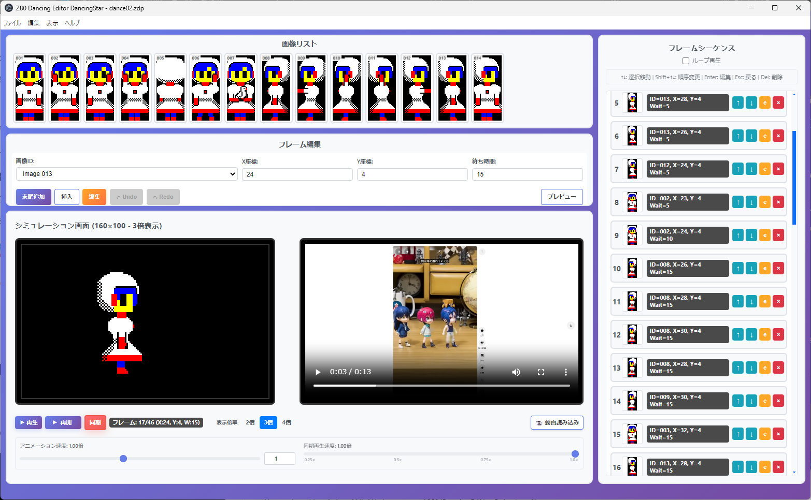

# DancingStar - Z80 アニメーション制作ツール

> このプロジェクトは **GitHub Copilot** による Vive Coding で作成されました。

キャラクターアニメーションを簡単に作成できるアプリケーションです 🎬

## DancingStarとは？

DancingStarは、キャラクターアニメーションを簡単に作成できるツールです。画像を読み込んで、直感的な操作でアニメーションを作成し、すぐにプレビューできます。作成したアニメーションはZ80アセンブリコードとして出力できます。

## 📸 実行画面

### メイン画面


*左側で画像とフレームを編集、右側でリアルタイムプレビューを確認できます*


## 🎯 できること

### ✨ 簡単アニメーション制作
- 画像ファイル（PNG/JPEG）を読み込み
- フレームを追加してアニメーションシーケンスを作成
- 即座にプレビューを確認しながら調整

### 🖼️ 画像の自動変換
- 任意サイズの画像を自動でセミグラフィック形式に変換
- 160×100ピクセルの解像度でリアルタイムプレビュー
- カラーも自動で8色に最適化

### 💾 プロジェクト保存
- 作成したアニメーションを.zdp形式で保存
- いつでも編集を再開可能

### ⚡ Z80コード出力
- 作成したアニメーションをZ80アセンブリコードとして出力
- メニューから「エクスポート」→「Z80コード」(`Ctrl+E`) で出力
- 実機やエミュレータで実行可能

## 🚀 使い方


### インストール・起動方法

1. Node.js（v18以上）をインストールしてください。
2. コマンドプロンプトで以下を実行します：

```cmd
git clone https://github.com/ueno1969/DancingEditor.git
cd DancingEditor
npm install
```

3. アプリケーションを起動します：

```cmd
npm start
```

4. 画像は `images` フォルダから自動で読み込まれます。
5. メニューの「画像をインポート」から画像分割・配置も可能です。
6. Z80コード出力はメニューの「エクスポート」→「Z80コード」(`Ctrl+E`) で行えます。

---
#### 💻 コマンドライン（上級者向け）
プロジェクトファイルからZ80アセンブリコードを直接生成することも可能です：

```cmd
npm run create:z80 my_project.zdp output.asm
```

例：
```cmd
npm run create:z80 dance01.zdp dancing_code.asm
```

## 🎮 操作方法

1. **DancingStarを起動**
2. **画像を準備**:
   - アプリは起動時に`images`フォルダから画像を自動読み込み
   - 新しい画像を使用する場合は、メニューから「画像をインポート」(`Ctrl+I`)を選択
   - インポート機能では大きな画像を指定サイズに分割して`images`フォルダに自動配置
3. **フレームを追加**: アニメーションの各コマを作成
4. **動画同期機能（オプション）**: 
   - 「📹 動画読み込み」ボタンで参考動画（MP4/AVI/MOV/MKV/WebM）を読み込み
   - アニメーションと動画を同期再生して制作の参考に
5. **プレビュー再生**: 作成したアニメーションを確認
6. **プロジェクト保存**: .zdp形式で保存
7. **Z80コード出力**: メニューから「エクスポート」→「Z80コード」(`Ctrl+E`) でアセンブリコードを出力

### 💻 コマンドライン（上級者向け）

プロジェクトファイルからZ80アセンブリコードを直接生成することも可能です：

```cmd
npm run create:z80 my_project.zdp output.asm
```

例：
```cmd
npm run create:z80 dance01.zdp dancing_code.asm
```

### ⌨️ キーボードショートカット

#### ファイル操作
- `Ctrl+N` - 新しいプロジェクト
- `Ctrl+O` - プロジェクトを開く
- `Ctrl+S` - プロジェクトを保存
- `Ctrl+Shift+S` - 名前をつけて保存
- `Ctrl+E` - Z80コードをエクスポート
- `Ctrl+I` - 画像をインポート

#### 編集操作
- `Ctrl+Z` - 元に戻す
- `Ctrl+Y` - やり直し
- `↑/↓` - フレーム選択の移動
- `Shift+↑/↓` - 選択されたフレームを上下に移動
- `Enter` - 選択フレームの編集開始
- `Delete/Backspace` - 選択フレームを削除
- `Escape` - 入力フィールドからフォーカスを外す

#### 再生操作
- `Space` - 動画再生中の一時停止・再開

### 📂 samplesフォルダの活用例

- `samples/sample001.zdp` … サンプルプロジェクトファイル。DancingStarで開いて編集やZ80コード出力の練習に使えます。
- `samples/sample001.asm` … サンプルのZ80アセンブリ出力例。エクスポート結果の参考に。
- `samples/sample_image.png` … サンプル画像。画像インポートや編集のテストに利用できます。

#### サンプルプロジェクトの開き方
1. メニューから「プロジェクトを開く」を選択し、`samples/sample001.zdp`を指定
2. 画像やアニメーション編集、Z80コード出力などを自由に試せます

## 💡 ヒント

- 画像は32×68ピクセル程度が最適ですが、自動でリサイズされます
- アニメーションは短いループが効果的です
- セミグラフィック形式では2×4ピクセル単位で描画されます

## 🛠️ 動作環境

- Windows 10/11
- Node.js v18以上
- 最低4GBのRAM推奨

## ❓ トラブルシューティング

### アプリが起動しない
```cmd
npm install
npm start
```
を再実行してください。

### 画像が読み込めない
PNG、JPEG形式の画像をご使用ください。

### Z80コードが生成されない
プロジェクトファイル（.zdp）が正しく保存されているか確認してください。

---

**DancingStar**でZ80アニメーションを楽しく作成しましょう！🎉
